```mermaid
flowchart LR
    A1[Markdown 写作] --> A2[æ’入图片]
    A2 --> B1{选择模å¼}

    B1 -->|API| B2[md2wechat.cn]
    B1 -->|AI| B3[Claude AI]

    B2 --> B4[HTML 生æˆ]
    B3 --> B4

    B4 --> C1[预览效æœ]
    C1 --> C2{满æ„å—}

    C2 -->|调整| B1
    C2 -->|OK| C3[上传图片]
    C3 --> C4[å‘é€è‰ç¨¿]
    C4 --> C5[完æˆ]

    classDef write fill:#e3f2fd,stroke:#2196f3,color:#0d47a1
    classDef ai fill:#fff3e0,stroke:#ff9800,color:#e65100
    classDef done fill:#e8f5e9,stroke:#4caf50,color:#1b5e20
    classDef success fill:#c8e6c9,stroke:#4caf50,color:#1b5e20

    class A1,A2 write
    class B3 ai
    class C4,C5 done
```

# writer$

<div align="center">

**用 Markdown 写公众号文章，像发朋友圈一样简单**

[](https://golang.org)
[](LICENSE)
[](https://github.com/royalrick/wechatwriter/app/releases)
[](#-claude-code-集成)
[![zread](https://img.shields.io/badge/Ask_Zread-_.svg?style=flat&color=00b0aa&labelColor=000000&logo=data%3Aimage%2Fsvg%2Bxml%3Bbase64%2CPHN2ZyB3aWR0aD0iMTYiIGhlaWdodD0iMTYiIHZpZXdCb3g9IjAgMCAxNiAxNiIgZmlsbD0ibm9uZSIgeG1sbnM9Imh0dHA6Ly93d3cudzMub3JnLzIwMDAvc3ZnIj4KPHBhdGggZD0iTTQuOTYxNTYgMS42MDAxSDIuMjQxNTZDMS44ODgxIDEuNjAwMSAxLjYwMTU2IDEuODg2NjQgMS42MDE1NiAyLjI0MDFWNC45NjAxQzEuNjAxNTYgNS4zMTM1NiAxLjg4ODEgNS42MDAxIDIuMjQxNTYgNS42MDAxSDQuOTYxNTZDNS4zMTUwMiA1LjYwMDEgNS42MDE1NiA1LjMxMzU2IDUuNjAxNTYgNC45NjAxVjIuMjQwMUM1LjYwMTU2IDEuODg2NjQgNS4zMTUwMiAxLjYwMDEgNC45NjE1NiAxLjYwMDFaIiBmaWxsPSIjZmZmIi8%2BCjxwYXRoIGQ9Ik00Ljk2MTU2IDEwLjM5OTlIMi4yNDE1NkMxLjg4ODEgMTAuMzk5OSAxLjYwMTU2IDEwLjY4NjQgMS42MDE1NiAxMS4wMzk5VjEzLjc1OTlDMS42MDE1NiAxNC4xMTM0IDEuODg4MSAxNC4zOTk5IDIuMjQxNTYgMTQuMzk5OUg0Ljk2MTU2QzUuMzE1MDIgMTQuMzk5OSA1LjYwMTU2IDE0LjExMzQgNS42MDE1NiAxMy43NTk5VjExLjAzOTlDNS42MDE1NiAxMC42ODY0IDUuMzE1MDIgMTAuMzk5OSA0Ljk2MTU2IDEwLjM5OTlaIiBmaWxsPSIjZmZmIi8%2BCjxwYXRoIGQ9Ik0xMy43NTg0IDEuNjAwMUgxMS4wMzg0QzEwLjY4NSAxLjYwMDEgMTAuMzk4NCAxLjg4NjY0IDEwLjM5ODQgMi4yNDAxVjQuOTYwMUMxMC4zOTg0IDUuMzEzNTYgMTAuNjg1IDUuNjAwMSAxMS4wMzg0IDUuNjAwMUgxMy43NTg0QzE0LjExMTkgNS42MDAxIDE0LjM5ODQgNS4zMTM1NiAxNC4zOTg0IDQuOTYwMVYyLjI0MDFDMTQuMzk4NCAxLjg4NjY0IDE0LjExMTkgMS42MDAxIDEzLjc1ODQgMS42MDAxWiIgZmlsbD0iI2ZmZiIvPgo8cGF0aCBkPSJNNCAxMkwxMiA0TDQgMTJaIiBmaWxsPSIjZmZmIi8%2BCjxwYXRoIGQ9Ik00IDEyTDEyIDQiIHN0cm9rZT0iI2ZmZiIgc3Ryb2tlLXdpZHRoPSIxLjUiIHN0cm9rZS1saW5lY2FwPSJyb3VuZCIvPgo8L3N2Zz4K&logoColor=ffffff)](https://zread.ai/royalrick/wechatwriter)

---

> ### ⚠️ 重要提示：API 模式需要 wechatwriter.cn API 服务
> **本工具使用 wechatwriter.cn API 服务，使用 API 模式前需要先获取 API Key**
>
> - 📖 **API 文档**：https://www.wechatwriter.cn/api-docs
> - 📧 **联系获取**：通过 [官网](https://www.wechatwriter.cn/api-docs) 联系获取 API Key
> - 💡 **AI 模式**：不需要 API Key，直接使用 Claude 即可

---

[快速开始](#-5分钟快速上手) • [Claude Code](#-claude-code-集成) • [功能介绍](#-核心功能) • [使用说明](#-使用方法) • [常见问题](#-常见问题)

---

## 🚀 Claude Code 用户（推荐）

在 Claude Code 中运行以下命令即可使用：

```bash
/plugin marketplace add royalrick/wechatwriter
/plugin install wechatwriter@royalrick-wechatwriter
```

然后直接对话：**"请用秋日暖光主题将 article.md 转换为微信公众号格式"**

</div>

## ✨ 这是什么？

**Writer for WeChat** 是一个让你的微信公众号写作更高效的神器。

> 💡 **一句话理解**：用 Markdown 写文章 → 一键转换 → 自动发到微信草稿箱

**适合谁用？**

| 你是 | 痛点 | writer 帮你 |
|------|------|---------------|
| 📝 内容创作者 | 微信编辑器太难用，排版花时间 | Markdown 写作，自动排版 |
| 💼 产品经理 | 要发公告，但不会 HTML | 不用学代码，一行命令搞定 |
| 👨‍💻 程序员 | 习惯 Markdown，讨厌微信编辑器 | 保持你的写作习惯 |
| 🤖 AI 用户 | 用 AI 生成内容，但要手动复制粘贴 | AI 生成 → 微信草稿，无缝衔接 |

---

## 🎯 核心功能

```mermaid
flowchart LR
    A[用 Markdown 写文章] --> B{选择模式}

    B -->|API 模式| C[调用 wechatwriter.cn API]
    C --> D[获取 HTML]

    B -->|AI 模式 ⭐| E[Claude AI 生成 HTML]
    E --> F[精美排版]

    D --> G[预览效果]
    F --> G

    G --> H{满意吗}
    H -->|不满意| B
    H -->|满意| I[上传图片]
    I --> J[发送到微信草稿箱]
    J --> K[完成]

    classDef nodeA fill:#e3f2fd,stroke:#2196f3,color:#0d47a1
    classDef nodeE fill:#fff3e0,stroke:#ff9800,color:#e65100
    classDef nodeJ fill:#e8f5e9,stroke:#4caf50,color:#1b5e20
    classDef nodeK fill:#c8e6c9,stroke:#4caf50,color:#1b5e20

    class A nodeA
    class E nodeE
    class J nodeJ
    class K nodeK
```



### 四大核心功能

| 功能 | 命令 | 说明 | 适合谁 |
|------|------|------|--------|
| **Markdown 转换** | `convert` | 将 Markdown 转换为微信格式 HTML | 所有用户 |
| **风格写作** | `write` | 用创作者风格辅助写作，自动生成文章和封面提示词 | 写作小白、内容创作者 |
| **AI 去痕** 🆕 | `humanize` | 去除 AI 生成痕迹，让文章听起来更自然、像人写的 | AI 写作用户 |
| **草稿推送** | `convert --draft` | 一键发送到微信草稿箱 | 需要频繁发布的用户 |

**`write` 与 `convert` 的区别：**

| 对比项 | `write` 命令 | `convert` 命令 |
|--------|-------------|---------------|
| **输入** | 一个想法/观点/片段 | 完整的 Markdown 文件 |
| **输出** | 结构化提示词（AI 处理后生成文章） | 微信格式 HTML |
| **用途** | 从零开始创作 | 格式转换已有内容 |
| **封面** | 自动生成封面提示词 | 需要手动指定封面图 |

**简单理解：**
- `write` = 帮你写文章（从想法到完整文章）
- `convert` = 帮你排版（从 Markdown 到微信格式）

### 两种转换模式

| 模式 | 适合谁 | 特点 | 样式 |
|------|--------|------|------|
| **API 模式** | 追求稳定、快速 | 调用 md2wechat.cn API，秒级响应 | 简洁专业 |
| **AI 模式** ⭐ | 追求精美排版 | Claude AI 生成，样式更丰富 | 秋日暖光 / 春日清新 / 深海静谧 |

### 完整工作流程



---

## 🚀 5分钟快速上手

### 第一步：下载软件

> 💡 **最新版本**：访问 [Releases 页面](https://github.com/royalrick/wechatwriter/app/releases) 下载

| 你的系统 | 下载链接 | 安装位置 |
|----------|----------|----------|
| 🪟 **Windows** | [下载 .exe](https://github.com/royalrick/wechatwriter/app/releases/latest/download/writer-windows-amd64.exe) | 任意文件夹（或 `C:\Windows\System32\`） |
| 🍎 **Mac Intel 芯片** | [下载](https://github.com/royalrick/wechatwriter/app/releases/latest/download/writer-darwin-amd64) | `/usr/local/bin/` 或 `~/.local/bin/` |
| 🍎 **Mac Apple Silicon (M1/M2/M3/M4)** | [下载](https://github.com/royalrick/wechatwriter/app/releases/latest/download/writer-darwin-arm64) | `/usr/local/bin/` 或 `~/.local/bin/` |
| 🐧 **Linux (Intel/AMD)** | [下载](https://github.com/royalrick/wechatwriter/app/releases/latest/download/writer-linux-amd64) | `/usr/local/bin/` 或 `~/.local/bin/` |
| 🐧 **Linux (ARM/树莓派)** | [下载](https://github.com/royalrick/wechatwriter/app/releases/latest/download/writer-linux-arm64) | `/usr/local/bin/` 或 `~/.local/bin/` |

> 🔍 **如何确认 Mac 芯片类型？**
> - 点击屏幕左上角 **苹果图标** → **关于本机**
> - 查看「芯片」或「处理器」信息：
>   - 显示 `Apple M1/M2/M3/M4` → 下载 **Apple Silicon** 版本
>   - 显示 `Intel` → 下载 **Intel** 版本

**安装步骤**：

<details>
<summary><b>Windows 安装方法</b></summary>

1. 下载 `writer-windows-amd64.exe`
2. 重命名为 `writer.exe`（可选）
3. 放到任意文件夹，或复制到 `C:\Windows\System32\`（全局可用）
4. 打开 CMD 或 PowerShell，输入 `writer --help` 测试

</details>

<details>
<summary><b>Mac 安装方法</b></summary>

**请根据你的芯片类型选择对应命令：**

**Apple Silicon (M1/M2/M3/M4)：**
```bash
# 下载并移动到系统目录
curl -Lo writer https://github.com/royalrick/wechatwriter/app/releases/latest/download/writer-darwin-arm64
chmod +x writer$
sudo mv writer /usr/local/bin/

# 测试
writer --help
```

**Intel 芯片：**
```bash
# 下载并移动到系统目录
curl -Lo writer https://github.com/royalrick/wechatwriter/app/releases/latest/download/writer-darwin-amd64
chmod +x writer$
sudo mv writer /usr/local/bin/

# 测试
writer --help
```

**用户目录安装（无需 sudo）：**
```bash
# Apple Silicon
mkdir -p ~/.local/bin
curl -Lo ~/.local/bin/writer https://github.com/royalrick/wechatwriter/app/releases/latest/download/writer-darwin-arm64
chmod +x ~/.local/bin/writer

# Intel 芯片（将上面 URL 中的 arm64 改为 amd64）

# 添加到 PATH（如果还没有）
echo 'export PATH="$HOME/.local/bin:$PATH"' >> ~/.zshrc
source ~/.zshrc

# 测试
writer --help
```

</details>

<details>
<summary><b>Linux 安装方法</b></summary>

**请根据你的架构选择对应命令：**

**Intel/AMD (x86_64)：**
```bash
# 下载并移动到系统目录
curl -Lo writer https://github.com/royalrick/wechatwriter/app/releases/latest/download/writer-linux-amd64
chmod +x writer$
sudo mv writer /usr/local/bin/

# 测试
writer --help
```

**ARM/树莓派 (aarch64)：**
```bash
# 下载并移动到系统目录
curl -Lo writer https://github.com/royalrick/wechatwriter/app/releases/latest/download/writer-linux-arm64
chmod +x writer$
sudo mv writer /usr/local/bin/

# 测试
writer --help
```

**用户目录安装（无需 sudo）：**
```bash
mkdir -p ~/.local/bin
# Intel/AMD 用 amd64，ARM 用 arm64
curl -Lo ~/.local/bin/writer https://github.com/royalrick/wechatwriter/app/releases/latest/download/writer-linux-amd64
chmod +x ~/.local/bin/writer

# 添加到 PATH（如果还没有）
echo 'export PATH="$HOME/.local/bin:$PATH"' >> ~/.bashrc  # 或 ~/.zshrc
source ~/.bashrc

# 测试
writer --help
```

</details>

> ⚠️ **Mac 用户**：下载后如果提示「无法打开」，右键点击 → 打开 → 仍要打开

### 第二步：配置微信（只需一次）

```bash
writer config init
```

用记事本打开生成的配置文件（会显示路径），填入两个信息：

| 配置项 | 是什么 | 在哪获取 |
|--------|--------|----------|
| AppID | 公众号唯一标识 | mp.weixin.qq.com → 设置与开发 → 基本配置 |
| Secret | API 密钥 | 同上，需要管理员权限 |

### 第三步：开始使用

```bash
# 1. 用 Markdown 写好文章（假设文件叫 article.md）

# 2. 预览效果
writer convert article.md --preview

# 3. 发送到微信草稿箱
writer convert article.md --draft --cover cover.jpg
```

> 💡 **小贴士**：第一次使用时，命令会自动引导你完成配置。

---

## 📖 使用方法

### 基础命令

```bash
# 预览转换效果（不发送）
writer convert article.md --preview

# 转换并保存为 HTML 文件
writer convert article.md -o output.html

# 使用 AI 模式生成精美排版
writer convert article.md --mode ai --theme autumn-warm --preview
```

### 风格写作 🆕

```bash
# 查看所有可用写作风格
writer write --list

# 用 Dan Koe 风格写文章（交互模式）
writer write

# 用指定风格写文章，从观点生成
writer write --style dan-koe

# 润色现有文章
writer write --style dan-koe --input-type fragment article.md

# 生成匹配的封面提示词
writer write --style dan-koe --cover-only

# 同时生成文章和封面
writer write --style dan-koe --cover
```

**写作风格说明：**

| 风格 | 特点 | 适合内容 |
|------|------|----------|
| **Dan Koe** | 深刻但不晦涩，犀利但不刻薄，有哲学深度但接地气 | 个人成长、观点文章、评论 |

**如何添加自定义风格：**

在 `writers/` 目录下创建 YAML 文件即可，格式参考 `writers/dan-koe.yaml`。

### 风格写作工作原理

```
┌─────────────────────────────────────────────────────────────────────┐
│                      风格写作 (write 命令)                           │
│                                                                       │
│  你只需要提供一个想法 → AI 自动生成符合特定创作者风格的文章            │
│                                                                       │
└─────────────────────────────────────────────────────────────────────┘
```

**核心概念：**

| 概念 | 说明 | 示例 |
|------|------|------|
| **写作风格** | 特定创作者的写作 DNA，包括语气、结构、用词习惯 | Dan Koe：深刻犀利、接地气 |
| **输入类型** | 你提供的内容类型 | 观点、片段、大纲、标题 |
| **AI 模式** | 返回结构化提示词，由 Claude 等大模型生成内容 | 默认模式 |
| **封面提示词** | 根据文章内容自动生成的配图提示 | 匹配写作风格 |

**完整工作流程：**

```mermaid
flowchart LR
    A[你提供想法] --> B{选择写作风格}
    B --> C[构建结构化提示词]

    C --> D{AI 处理}
    D --> E[生成完整文章]

    E --> F{需要封面?}
    F -->|是| G[生成封面提示词]
    F -->|否| H[输出文章]

    G --> I[用 AI 生成封面图]
    I --> J[上传到微信素材库]
    H --> K[转换为微信格式]
    J --> K
    K --> L[发送到草稿箱]

    classDef idea fill:#e3f2fd,stroke:#2196f3,color:#0d47a1
    classDef creator fill:#fff3e0,stroke:#ff9800,color:#e65100
    classDef ai fill:#f3e5f5,stroke:#9c27b0,color:#4a148c
    classDef output fill:#e8f5e9,stroke:#4caf50,color:#1b5e20

    class A idea
    class B,C creator
    class D,E,G,I ai
    class H,J,K,L output
```



**输入类型说明：**

| 输入类型 | 说明 | 示例 |
|----------|------|------|
| `idea` | 一个观点或想法 | "我觉得自律是个伪命题" |
| `fragment` | 内容片段，需要润色扩展 | 现有的草稿或未完成的文章 |
| `outline` | 文章大纲 | 有结构，需要填充内容 |
| `title` | 仅标题，围绕标题写作 | "自律是个谎言" |

**输出说明：**

```bash
# AI 模式输出（默认）
{
  "success": true,
  "mode": "ai",
  "action": "ai_write_request",
  "style": "Dan Koe",
  "prompt": "结构化的写作提示词..."
}

# 带封面的输出
{
  "success": true,
  "prompt": "文章提示词...",
  "cover_prompt": "封面提示词...",
  "cover_explanation": "封面设计思路..."
}
```

> 💡 **重要说明**：`write` 命令默认使用 **AI 模式**，返回的是结构化提示词，需要由 Claude 等 AI 大模型处理才能生成最终文章。在 Claude Code 中使用时，这个流程是自动的。

**从想法到发布的完整流程：**

```mermaid
flowchart TB
    subgraph Phase1["📝 阶段1：创作"]
        A1[你的想法] --> A2[选择写作风格]
        A2 --> A3[AI 生成文章]
        A3 --> A4[生成封面提示词]
    end

    subgraph Phase2["🎨 阶段2：制作"]
        B1[AI 生成封面图] --> B2[上传到微信素材库]
        A4 --> B1
        A3 --> B3[保存为 Markdown]
    end

    subgraph Phase3["📤 阶段3：发布"]
        C1[转换为微信格式] --> C2[发送到草稿箱]
        B2 --> C1
        B3 --> C1
        C2 --> C3[在微信编辑器中微调]
        C3 --> C4[发布！]
    end

    classDef phase1 fill:#e3f2fd,stroke:#2196f3,color:#0d47a1
    classDef phase2 fill:#fff3e0,stroke:#ff9800,color:#e65100
    classDef phase3 fill:#e8f5e9,stroke:#4caf50,color:#1b5e20

    class A1,A2,A3,A4 phase1
    class B1,B2,B3 phase2
    class C1,C2,C3,C4 phase3
```



**一条命令完成全流程（在 Claude Code 中）：**

```
"用 Dan Koe 风格写一篇关于 AI 时代程序员怎么搞钱的文章，生成封面，并发送到微信草稿箱"
```

Claude 会自动：
1. 调用 `write` 命令生成文章和封面提示词
2. 用 AI 生成封面图并上传
3. 转换为微信格式
4. 发送到草稿箱

### AI 写作去痕 🆕

> 💡 **致谢**：AI 写作去痕功能基于 [Humanizer-zh](https://github.com/op7418/Humanizer-zh) 项目，感谢作者 **臧师傅** 的分享。

**什么是 AI 去痕？**

AI 生成的文章往往有明显的"AI 味"——公式化的表达、重复的结构、浮夸的词汇。AI 去痕功能可以识别并去除这些痕迹，让文章听起来更像真人写的。

**能检测哪些 AI 痕迹？**

| 类别 | 检测模式 | 示例 |
|------|----------|------|
| **内容模式** | 过度强调意义、宣传语言、模糊归因 | "标志着"、"凸显了"、"行业报告显示" |
| **语言模式** | AI 词汇、否定排比、三段式 | "此外"、"深入探讨"、"不仅…而且…" |
| **风格模式** | 破折号过度、粗体滥用、表情符号 | 过度使用 `——`、大量 `**粗体**` |
| **填充词** | 填充短语、过度限定、通用结论 | "为了实现这一目标"、"未来一片光明" |
| **协作痕迹** | 对话式填充、知识截止免责声明 | "希望这对您有帮助"、"截至 2024 年" |

**三种处理强度：**

| 强度 | 命令 | 适合场景 |
|------|------|----------|
| `gentle` | `--intensity gentle` | 文章已经比较自然，只处理明显问题 |
| `medium` | 默认 | 大多数场景，平衡处理 |
| `aggressive` | `--intensity aggressive` | AI 味很重的文章，深度改写 |

**使用方法：**

```bash
# 独立使用：去除文章的 AI 痕迹
writer humanize article.md

# 指定强度
writer humanize article.md --intensity aggressive

# 显示修改对比和质量评分
writer humanize article.md --show-changes

# 输出到文件
writer humanize article.md -o output.md
```

**与写作风格组合使用：**

```bash
# 写作 + 去痕：生成文章后自动去除 AI 痕迹
writer write --style dan-koe --humanize

# 指定去痕强度
writer write --style dan-koe --humanize --humanize-intensity aggressive
```

> 💡 **风格优先原则**：当与写作风格组合时，会保留风格的核心特征（如 Dan Koe 的破折号），只去除无意的 AI 痕迹。

**AI 去痕工作流程：**

```mermaid
flowchart LR
    A[AI 生成的文章] --> B[识别 AI 痕迹模式]
    B --> C{检测到问题}

    C --> D[过度强调意义]
    C --> E[AI 词汇]
    C --> F[三段式结构]
    C --> G[填充短语]
    C --> H[协作痕迹]

    D --> I[重写为自然表达]
    E --> I
    F --> J[打破公式结构]
    G --> I
    H --> K[删除客套话]

    I --> L[注入真实观点]
    J --> L
    K --> L

    L --> M[变化句子节奏]
    M --> N[人性化后的文章]

    N --> O{需要评分?}
    O -->|是| P[5维度质量评分]
    O -->|否| N

    P --> Q[输出结果]

    classDef ai fill:#ffebee,stroke:#f44336,color:#c62828
    classDef problem fill:#fff3e0,stroke:#ff9800,color:#e65100
    classDef fix fill:#e3f2fd,stroke:#2196f3,color:#0d47a1
    classDef result fill:#e8f5e9,stroke:#4caf50,color:#1b5e20

    class A ai
    class B,C,D,E,F,G,H problem
    class I,J,K,L,M fix
    class N,P,Q result
```



**质量评分系统：**

去除 AI 痕迹后，会给出 5 维度评分（总分 50）：

| 维度 | 说明 | 评分标准 |
|------|------|----------|
| **直接性** | 是否直截了当 | 10 分：直击要点；1 分：充满铺垫 |
| **节奏** | 句子长度是否变化 | 10 分：长短交错；1 分：机械重复 |
| **信任度** | 是否尊重读者 | 10 分：简洁明了；1 分：过度解释 |
| **真实性** | 听起来像真人吗 | 10 分：自然流畅；1 分：机械生硬 |
| **精炼度** | 有无冗余内容 | 10 分：无废话；1 分：大量填充 |

**评级标准：**
- **45-50 分**：优秀，已去除 AI 痕迹
- **35-44 分**：良好，仍有改进空间
- **低于 35 分**：需要重新修订

**去痕效果对比：**

| 原文（AI 味） | 去痕后 |
|--------------|--------|
| 在当今快速发展的科技时代，人工智能技术正以前所未有的速度改变着我们的生活方式 | 这几年，AI 变化太快了 |
| 人工智能的重要性不言而喻。它不仅标志着技术进步的新里程碑 | AI 挺重要的，但不是那种玄乎的重要 |
| 此外，AI 技术还在改善我们的日常生活质量 | 顺手提一句，AI 确实让生活方便了不少 |
| 尽管存在挑战，但人工智能的未来依然光明 | 未来会怎样不好说，有好有坏吧 |
| 希望这对您有帮助 | —— |

**自然语言使用（在 Claude Code 中）：**

```
"去除这篇文章的 AI 痕迹"
"让这篇文章听起来更像人写的"
"用温和强度处理这篇文章"
"用 Dan Koe 风格写一篇文章，然后去除 AI 痕迹"
```

### 完整发布流程

```bash
# 一步到位：转换 + 上传图片 + 发送草稿
writer convert article.md --draft --cover cover.jpg

# 流程说明：
# 1. 将 Markdown 转换为微信格式 HTML
# 2. 上传封面图片到微信素材库
# 3. 创建草稿并推送到微信后台
```

### AI 模式主题选择

| 主题名 | 命令 | 风格 | 适合内容 |
|--------|------|------|----------|
| 🟠 **秋日暖光** | `--theme autumn-warm` | 温暖橙色调 | 情感故事、生活随笔 |
| 🟢 **春日清新** | `--theme spring-fresh` | 清新绿色调 | 旅行日记、自然主题 |
| 🔵 **深海静谧** | `--theme ocean-calm` | 专业蓝色调 | 技术文章、商业分析 |

### API 模式主题选择

| 主题名 | 命令 | 风格 | 适合内容 |
|--------|------|------|----------|
| **默认** | `--mode api` 或默认 | 简洁专业 | 通用内容 |
| **bytedance** | `--theme bytedance` | 字节跳动风格 | 科技资讯 |
| **apple** | `--theme apple` | Apple 极简风格 | 产品评测 |
| **sports** | `--theme sports` | 运动活力风格 | 体育内容 |
| **chinese** | `--theme chinese` | 中国传统文化风格 | 文化文章 |
| **cyber** | `--theme cyber` | 赛博朋克风格 | 前沿科技 |

### 图片处理

```bash
# 上传单张图片到微信素材库
writer upload_image photo.jpg

# 下载网络图片并上传
writer download_and_upload https://example.com/image.jpg

# AI 生成图片并上传（需要配置 IMAGE_API_KEY）
writer generate_image "A cute cat sitting on a windowsill"

# 生成 16:9 比例的封面图（推荐，适配公众号封面）
writer generate_image --size 2560x1440 "prompt"
```

> 💡 **公众号封面图建议**：使用 16:9 横向比例（2560x1440）作为文章封面，在微信 feed 流和文章列表中显示效果更好。方形图片（2048x2048）在预览时会被裁剪。

#### AI 图片生成服务配置 🆕

支持多种 AI 图片生成服务：

| 服务 | 配置值 | 说明 | 获取方式 |
|------|--------|------|----------|
| **ModelScope** | `modelscope` 或 `ms` | 阿里 ModelScope，免费额度 | [modelscope.cn](https://modelscope.cn/my/myaccesstoken) |
| **TuZi** | `tuzi` | 国产 API，稳定快速 | [tu-zi.com](https://api.tu-zi.com) |
| **OpenAI** | `openai` | 官方 OpenAI | [platform.openai.com](https://platform.openai.com) |

**配置方式**（环境变量或配置文件）：

```bash
# 使用 ModelScope（推荐，有免费额度）
export IMAGE_PROVIDER=modelscope
export IMAGE_API_KEY=ms-your-token-here
export IMAGE_API_BASE=https://api-inference.modelscope.cn
export IMAGE_MODEL=Tongyi-MAI/Z-Image-Turbo
```

```yaml
# config.yaml
api:
  image_provider: modelscope
  image_key: ms-your-token-here
  image_base_url: https://api-inference.modelscope.cn
  image_model: Tongyi-MAI/Z-Image-Turbo
  image_size: 1024x1024
```

**ModelScope 特点**：
- ✅ 有免费额度，适合测试
- ✅ 国内服务，访问稳定
- ✅ 默认模型 `Tongyi-MAI/Z-Image-Turbo` 生成速度快
- ⚠️ 使用异步 API（task_id + 轮询），约 10-30 秒完成

#### Markdown 中生成图片

在 Markdown 中使用特殊语法生成图片：

```markdown

```

**语法格式：** ``

- 支持中文和英文提示词
- 生成的图片会自动上传到微信素材库
- 需要配置图片生成服务（详见 [图片服务配置文档](docs/IMAGE_PROVISIONERS.md)）

**在 Claude Code 中使用自然语言：**
```
"帮我在文章开头生成一张产品概念图"
"在第三段后添加一张对比图"
"生成一张可爱的猫"（独立生成，不关联文章）
```

---

## 🤖 AI 模式详解

### 什么是 AI 模式？

**AI 模式**使用 Claude 大模型来生成精美的公众号排版，而不是简单的 API 转换。

```
┌─────────────────────────────────────────────────────────────┐
│                     AI 模式工作流程                          │
├─────────────────────────────────────────────────────────────┤
│                                                             │
│   1. 你用 Markdown 写文章                                    │
│              ↓                                               │
│   2. writer 提取文章结构                                  │
│              ↓                                               │
│   3. 构建专业的排版提示词 (Prompt)                           │
│              ↓                                               │
│   4. Claude AI 根据提示词生成 HTML                          │
│              ↓                                               │
│   5. 返回符合微信规范的 HTML                                 │
│                                                             │
└─────────────────────────────────────────────────────────────┘
```

### AI 模式的优势

| 对比项 | API 模式 | AI 模式 |
|--------|----------|----------|
| 响应速度 | ⚡ 秒级 | 🐢 10-30秒 |
| 排版质量 | 👍 标准规范 | 🌟 精美多样 |
| 样式选择 | 2-3 种 | 无限可能 |
| 成本 | 低 | 使用 Claude AI |
| 适合场景 | 日常文章 | 重要文章、品牌内容 |

### 在 Claude Code 中使用 AI 模式

如果你使用 **Claude Code**，AI 模式会自动调用内置的 Claude，无需额外配置：

```bash
# 在 Claude Code 中直接运行
writer convert article.md --mode ai --theme autumn-warm
```

---

## ⚙️ 配置说明

### 配置文件位置

```
~/.config/wechatwriter/config.yaml    # 全局配置（推荐）
```

### 配置项说明

```yaml
# 微信公众号配置（必需）
wechat:
  appid: "你的AppID"
  secret: "你的Secret"

# API 配置
api:
  md2wechat_key: "md2wechat.cn 的 API Key"  # API 模式需要
  convert_mode: "api"                       # 默认模式：api 或 ai
  default_theme: "default"                  # 默认主题
  http_timeout: 30                          # 超时时间（秒）

# 图片处理配置
image:
  compress: true           # 自动压缩大图
  max_width: 1920         # 最大宽度
  max_size_mb: 5          # 最大文件大小（MB）
```

---

## 📁 项目结构

```
wechatwriter/
├── cmd/                    # 命令行工具
│   └── writer/            # 主程序
├── internal/              # 核心功能模块
│   ├── converter/        # 转换器（API/AI）
│   ├── draft/            # 草稿服务
│   ├── image/            # 图片处理
│   ├── wechat/           # 微信 API 封装
│   ├── writer/           # 写作助手
│   ├── humanizer/        # AI 去痕 🆕
│   └── config/           # 配置管理
├── writers/              # 写作风格配置
│   ├── dan-koe.yaml      # Dan Koe 风格
│   └── README.md         # 自定义风格指南
├── docs/                 # 详细文档
│   ├── USAGE.md          # 使用教程
│   ├── FAQ.md            # 常见问题
│   └── TROUBLESHOOTING.md # 故障排查
├── examples/             # 示例文章
├── scripts/              # 安装脚本
└── bin/                  # 编译好的二进制文件
```

---

## 🔧 高级安装

### 方式一：Go 工具链

```bash
go install github.com/royalrick/wechatwriter/app/cmd/writer@latest
```

### 方式二：一键安装脚本

**Mac/Linux：**
```bash
curl -fsSL https://raw.githubusercontent.com/royalrick/wechatwriter/main/scripts/install.sh | bash
```

> 💡 脚本会自动检测你的系统架构并下载对应版本

**Windows PowerShell：**
```powershell
Set-ExecutionPolicy Bypass -Scope Process -Force
iex ((New-Object System.Net.WebClient).DownloadString('https://raw.githubusercontent.com/royalrick/wechatwriter/main/scripts/install.ps1'))
```

### 方式三：从源码编译

```bash
git clone https://github.com/royalrick/wechatwriter.git
cd wechatwriter
make build
```

---

## 🤖 Claude Code 集成

writer 提供了 **Claude Code Skill**，让你在 Claude Code 中直接使用自然语言转换文章。

### 安装方式

#### 方式一：Plugin Marketplace（推荐，最简单）

在 Claude Code 中运行以下命令：

```bash
# 添加插件市场
/plugin marketplace add royalrick/wechatwriter

# 安装插件
/plugin install wechatwriter@royalrick-wechatwriter
```

安装后，直接在 Claude Code 中对话即可使用：

```
请用秋日暖光主题将 article.md 转换为微信公众号格式
```

#### 方式二：项目内使用

克隆项目后，Skill 自动可用：

```bash
git clone https://github.com/royalrick/wechatwriter.git
cd wechatwriter
# 在 Claude Code 中直接使用
```

#### 方式三：全局安装

将专业 Skill 复制到全局目录：

```bash
# 复制所需的专业技能目录
cp -r skills/content-writing ~/.claude/skills/
cp -r skills/visual-design ~/.claude/skills/
# 根据需要复制其他专业技能...
```

#### 方式四：创建符号链接

```bash
ln -s /path/to/wechatwriter/skills/content-writing ~/.claude/skills/content-writing
ln -s /path/to/wechatwriter/skills/visual-design ~/.claude/skills/visual-design
# 根据需要链接其他专业技能...
```

### 项目结构

```
wechatwriter/
├── .claude-plugin/        # 插件清单
│   └── plugin.json
├── skills/                # Claude Code 专业技能集合
│   ├── topic-research/    # 选题研究专业skill
│   ├── content-writing/   # 内容创作专业skill
│   ├── visual-design/     # 视觉设计专业skill
│   ├── seo-optimization/  # SEO优化专业skill
│   ├── publishing-strategy/ # 发布策略专业skill
│   └── content-analysis/ # 内容分析专业skill
├── writers/               # 写作风格配置
├── themes/                # AI 主题配置
└── docs/                  # 文档目录
```

---

## 🎓 使用示例

### 示例 1：技术博主

```bash
# 写好技术文章
vim my-tech-post.md

# 使用简洁的 API 模式转换
writer convert my-tech-post.md --preview

# 满意后发送草稿
writer convert my-tech-post.md --draft --cover cover.jpg
```

### 示例 2：产品经理发公告

```bash
# AI 生成产品公告内容，然后
writer convert announcement.md --mode ai --theme ocean-calm --draft --cover product-logo.png
```

### 示例 3：生活方式博主

```bash
# 使用春日清新主题
writer travel-diary.md --mode ai --theme spring-fresh --preview
```

### 示例 4：写作小白用观点生成文章 🆕

```bash
# 交互模式：输入观点，AI 生成文章
writer write

# 指定风格生成
writer write --style dan-koe

# 生成封面提示词
writer write --style dan-koe --cover-only
```

---

## ❓ 常见问题

<details>
<summary><b>Q: 必须要会编程才能用吗？</b></summary>

**A: 不需要！** 只要会用命令行（终端）就可以。如果是 Windows 用户，下载 .exe 文件后，在 CMD 或 PowerShell 中运行命令即可。
</details>

<details>
<summary><b>Q: AI 模式需要付费吗？</b></summary>

**A:** AI 模式使用 Claude 能力：
- 如果你在 **Claude Code** 中使用，直接调用内置 AI
- 如果你想自己接入，需要配置 OpenAI 兼容的 API
</details>

<details>
<summary><b>Q: 支持哪些 Markdown 语法？</b></summary>

**A:** 支持常用语法：
- 标题（# ## ###）
- 列表（无序、有序）
- 粗体、斜体、行内代码
- 代码块（带语法高亮）
- 引用块
- 分割线
- 图片、链接
- 表格
</details>

<details>
<summary><b>Q: 生成的文章可以直接在微信编辑器中编辑吗？</b></summary>

**A:** 可以！草稿发送后，你可以登录微信公众平台，在草稿箱中继续编辑。
</details>

<details>
<summary><b>Q: 如何知道应该下载哪个版本？下载错了怎么办？</b></summary>

**A:**

**Mac 用户：**
- 点击屏幕左上角苹果图标 → 「关于本机」
- 看到 `Apple M1/M2/M3/M4` → 下载 **Apple Silicon (arm64)** 版本
- 看到 `Intel` → 下载 **Intel (amd64)** 版本

**Linux 用户：**
- 运行 `uname -m` 命令
- 输出 `x86_64` → 下载 **amd64** 版本
- 输出 `aarch64` → 下载 **arm64** 版本

**如果下载错了：**
- 删除错误的文件，重新下载正确版本即可
- 也可以使用一键安装脚本，会自动检测系统架构

```bash
curl -fsSL https://raw.githubusercontent.com/royalrick/wechatwriter/main/scripts/install.sh | bash
```
</details>

<details>
<summary><b>Q: 写作功能是什么？怎么用？</b></summary>

**A:** 写作功能可以帮你用特定创作者风格生成文章：

```bash
# 查看所有可用风格
writer write --list

# 交互式写作
writer write

# 指定风格写作
writer write --style dan-koe
```

只需输入你的观点或想法，AI 会自动生成符合该风格的文章。
</details>

<details>
<summary><b>Q: 我是写作小白，不会写文章能用吗？</b></summary>

**A:** 完全可以！写作功能专为小白设计：

1. **只需要输入观点**：比如"我觉得自律是个伪命题"
2. **AI 自动扩展**：会自动生成结构完整的文章
3. **多种风格可选**：内置 Dan Koe 等风格，也可以自定义

不需要你会写作技巧，只需要有想法就行。
</details>

<details>
<summary><b>Q: 如何添加我喜欢的作家风格？</b></summary>

**A:** 在 `writers/` 目录下创建 YAML 文件：

```bash
# 参考内置风格
cat writers/dan-koe.yaml

# 创建自己的风格
vim writers/my-style.yaml
```

详细格式参考 `writers/README.md`。
</details>

<details>
<summary><b>Q: AI 去痕是什么？怎么用？</b></summary>

**A:** AI 去痕功能可以去除 AI 生成文章的"AI 味"，让文章听起来更像真人写的：

```bash
# 基本用法
writer humanize article.md

# 指定强度（gentle/medium/aggressive）
writer humanize article.md --intensity aggressive

# 显示修改对比和质量评分
writer humanize article.md --show-changes
```

**与写作风格组合使用：**

```bash
# 写作 + 去痕
writer write --style dan-koe --humanize
```

> 💡 **致谢**：AI 去痕功能基于 [Humanizer-zh](https://github.com/op7418/Humanizer-zh) 项目。
</details>

<details>
<summary><b>Q: AI 去痕会改变文章意思吗？</b></summary>

**A:** 不会。AI 去痕只修改表达方式，不改变核心信息。

它会：
- 删除填充短语和过度强调
- 打破公式化结构
- 变化句子节奏
- 注入真实观点

但会保留原文的核心观点和信息。
</details>

<details>
<summary><b>Q: AI 去痕和写作风格会冲突吗？</b></summary>

**A:** 不会。当两者组合使用时，遵循**风格优先原则**：

- 保留写作风格的核心特征（如 Dan Koe 的破折号停顿）
- 只去除无意的 AI 痕迹
- 保持风格的一致性

```bash
# 风格优先：保留 Dan Koe 风格，去除 AI 痕迹
writer write --style dan-koe --humanize
```
</details>

<details>
<summary><b>Q: 发送草稿时报错 "content size out of limit (errcode=45002)"？</b></summary>

**A:** 这是微信 API 的内容大小限制错误。

**微信草稿 API 限制：**
- **字符数**：< 20,000 字符（中文算 1 个字符）
- **大小**：< 1 MB

**解决方案：**
1. 缩短文章内容
2. 减少不必要的格式（API 模式的 inline CSS 会增加内容体积）
3. 拆分为多篇文章发布
4. 使用更简洁的排版主题

**注意：** API 模式生成的 HTML 包含大量 inline CSS，会使内容体积膨胀约 5-10 倍。长文章建议：
- 使用更简洁的 Markdown 写作
- 删除部分图片或使用外部图片链接
- 手动在微信编辑器中复制粘贴（绕过 API 限制）

**来源：** [微信公众号 API 文档](https://developers.weixin.qq.com/doc/subscription/api/draftbox/draftmanage/api_draft_add.html)
</details>

<details>
<summary><b>Q: ModelScope 图片生成需要多久？</b></summary>

**A:** ModelScope 使用异步 API 模式，通常需要 10-30 秒。

**流程：**
1. 发起请求 → 获取 task_id
2. 轮询任务状态（每 5 秒一次）
3. 任务完成 → 返回图片 URL

**超时设置：**
- 默认最大轮询时间：120 秒
- 超时后会返回错误，建议：
  - 简化提示词
  - 重试一次
  - 检查 ModelScope 服务状态
</details>

<details>
<summary><b>Q: 如何配置 ModelScope 图片生成？</b></summary>

**A:** ModelScope 是推荐的图片生成服务，有免费额度。

**配置步骤：**

1. **获取 API Key**
   - 访问 [modelscope.cn](https://modelscope.cn/my/myaccesstoken)
   - 登录后创建 Access Token
   - 格式类似：`ms-your-token-here`

2. **配置环境变量**
   ```bash
   export IMAGE_PROVIDER=modelscope
   export IMAGE_API_KEY=ms-your-token-here
   export IMAGE_API_BASE=https://api-inference.modelscope.cn
   export IMAGE_MODEL=Tongyi-MAI/Z-Image-Turbo
   ```

3. **或在配置文件中设置**
   ```yaml
   # ~/.config/wechatwriter/config.yaml
   api:
     image_provider: modelscope
     image_key: ms-your-token-here
     image_base_url: https://api-inference.modelscope.cn
     image_model: Tongyi-MAI/Z-Image-Turbo
     image_size: 1024x1024
   ```

4. **测试**
   ```bash
   writer generate_image "A golden cat"
   ```
</details>

<details>
<summary><b>Q: write 命令支持管道输入吗？</b></summary>

**A:** 支持！可以通过管道或 heredoc 传递内容。

**使用方式：**

```bash
# 管道输入
echo "你的想法或内容" | writer write --style dan-koe

# heredoc 输入（适合多行内容）
writer write --style dan-koe --title "文章标题" <<EOF
第一段内容
第二段内容
更多观点...
EOF
```

**适用场景：**
- 脚本自动化
- 从其他命令输出传递内容
- 在 CI/CD 流程中使用
</details>

---

## 📚 更多文档

| 文档 | 说明 |
|------|------|
| [新手入门指南](QUICKSTART.md) | **强烈推荐！** 详细的图文教程 |
| [完整使用说明](docs/USAGE.md) | 所有命令和选项 |
| [图片服务配置](docs/IMAGE_PROVISIONERS.md) 🆕 | AI 图片生成服务完整配置指南 |
| [写作功能指南](writers/README.md) | 如何使用和自定义写作风格 |
| [写作功能问答](docs/WRITING_FAQ.md) | 写作小白完整指南 |
| [AI 去痕指南](app/humanizer/README.md) | AI 写作去痕完整指南 |
| [常见问题](docs/FAQ.md) | 20+ 常见问题解答 |
| [故障排查](docs/TROUBLESHOOTING.md) | 遇到问题看这里 |

---

## 🤝 贡献

欢迎提交 Issue 和 Pull Request！

如果你有好的想法或发现了 bug，请随时提 issue。

---

## 📄 许可证

[MIT License](LICENSE)

---

## 💰 打赏 Buy Me A Coffee

如果该项目帮助了您，请作者喝杯咖啡吧 ☕️

### WeChat


---

## 🧑‍💻 作者

- 作者：**geekjourneyx**
- X（Twitter）：https://x.com/seekjourney
- 公众号：极客杰尼

关注公众号，获取更多 AI 编程、AI 工具与 AI 出海建站的实战分享：

<p align="center">

</p>

---

<div align="center">

**让公众号写作更简单** ⭐

[主页](https://github.com/royalrick/wechatwriter) • [文档](docs) • [反馈](https://github.com/royalrick/wechatwriter/app/issues)

Made with ❤️ by [geekjourneyx](https://geekjourney.dev)

</div>
