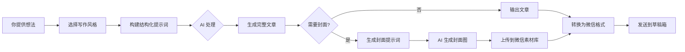

# 写作功能指南 (Writing Guide)

> **风格写作 (`write`)** 命令让你只需提供一个想法，AI 就能自动生成符合特定创作者风格的文章。

## 概述

写作功能是 writer 的辅助写作工具，特点：

- **零基础友好**：只需一个观点或想法，AI 自动扩展成完整文章
- **创作者风格**：内置 Dan Koe 等风格，支持自定义
- **封面自动生成**：根据文章内容自动匹配封面提示词
- **AI 模式**：返回结构化提示词，由 Claude 等大模型生成内容

---

## 命令格式

### 基本命令

```bash
# 交互式写作（最简单）
bash skills/writer/scripts/run.sh write

# 查看所有可用风格
bash skills/writer/scripts/run.sh write --list

# 指定风格写作
bash skills/writer/scripts/run.sh write --style dan-koe

# 通过管道输入内容（非交互式）
echo "你的想法或内容" | bash skills/writer/scripts/run.sh write --style dan-koe

# 指定标题写作
bash skills/writer/scripts/run.sh write --style dan-koe --title "文章标题" <<EOF
你的内容
EOF

# 只生成封面提示词
bash skills/writer/scripts/run.sh write --style dan-koe --cover-only

# 同时生成文章和封面
bash skills/writer/scripts/run.sh write --style dan-koe --cover
```

### 输入类型

| 类型 | 参数 | 说明 | 示例 |
|------|------|------|------|
| **观点** | `--input-type idea` | 一个观点或想法 | "我觉得自律是个伪命题" |
| **片段** | `--input-type fragment` | 内容片段，需要润色扩展 | 现有的草稿或未完成的文章 |
| **大纲** | `--input-type outline` | 文章大纲，需要填充内容 | 有结构，需要填充内容 |
| **标题** | `--input-type title` | 仅标题，围绕标题写作 | "自律是个谎言" |

### 其他参数

| 参数 | 说明 |
|------|------|
| `--style` | 写作风格（默认: dan-koe） |
| `--length` | 文章长度：short/medium/long |
| `--title` | 文章标题 |
| `-o, --output` | 输出文件路径 |
| `--cover` | 同时生成封面提示词 |
| `--cover-only` | 仅生成封面提示词 |
| `--list` | 列出所有可用风格 |
| `--detail` | 显示详细风格信息 |

---

## 使用场景

### 场景 1：从零开始写文章（交互式）

**输入**：一个想法或观点

```bash
bash skills/writer/scripts/run.sh write
```

然后输入：

```
我觉得自律是个伪命题
```

**输出**：

- 完整的文章结构
- 丰富的内容扩展
- 精彩的金句
- 可选的封面提示词

### 场景 2：从零开始写文章（非交互式）

**输入**：通过管道传递内容

```bash
echo "我觉得自律是个伪命题，大多数人坚持不下来是因为内心深处并不真正想要那个结果" | \
bash skills/writer/scripts/run.sh write --style dan-koe
```

或使用 heredoc：

```bash
bash skills/writer/scripts/run.sh write --style dan-koe --title "自律是个谎言" <<EOF
我觉得自律是个伪命题。
大多数人坚持不下来是因为内心深处并不真正想要那个结果。
EOF
```

### 场景 3：润色现有文章

```bash
bash skills/writer/scripts/run.sh write --style dan-koe --input-type fragment article.md
```

### 场景 4：只生成封面

```bash
bash skills/writer/scripts/run.sh write --style dan-koe --cover-only
```

输入文章内容后，获得：

- 封面生成提示词
- 封面设计思路说明

---

## AI 模式说明

`write` 命令默认使用 **AI 模式**：

1. 命令返回结构化的提示词（JSON 格式）
2. 由 Claude 等大模型处理提示词
3. 生成最终文章内容

**在 Claude Code 中使用时，这个流程是自动的。**

### AI 模式输出

```json
{
  "success": true,
  "mode": "ai",
  "action": "ai_write_request",
  "style": "Dan Koe",
  "prompt": "结构化的写作提示词..."
}
```

### 带封面的输出

```json
{
  "success": true,
  "prompt": "文章提示词...",
  "cover_prompt": "封面提示词...",
  "cover_explanation": "封面设计思路..."
}
```

---

## 内置风格

### Dan Koe 风格

**特点**：

- 深刻但不晦涩
- 犀利但不刻薄
- 有哲学深度但接地气

**适合内容**：

- 个人成长类文章
- 观点评述
- 人生感悟
- 方法论分享

---

## 自定义风格

在 `writers/` 目录下创建 YAML 文件即可添加自定义风格：

```yaml
name: "我的风格"
english_name: "my-style"
description: "简洁有力"

writing_prompt: |
  你是一位简洁有力的写作者。
  用最少的字表达最清晰的观点。
  避免废话，直击要点。

cover_prompt: |
  为文章生成一个简洁有力的封面提示词。
  使用极简主义风格。

cover_style: "minimalist"
cover_mood: "professional"
cover_color_scheme: ["#000000", "#FFFFFF", "#FF0000"]
```

详细格式参考 `writers/dan-koe.yaml`。

---

## 完整工作流程



---

## 自然语言使用

在 Claude Code 中，可以直接用自然语言：

```
"用 Dan Koe 风格写一篇关于 AI 时代程序员怎么搞钱的文章"
"帮我的文章润色一下，用更犀利的风格"
"生成一个匹配的封面"
```

Claude 会自动调用 `write` 命令并处理结果。

---

## 封面生成

### 封面尺寸建议

| 用途 | 推荐尺寸 | 说明 |
|------|----------|------|
| **文章封面** | 2560x1440 (16:9) | 横向比例，在微信 feed 流和文章列表显示效果更好 |
| **默认生成** | 2048x2048 (1:1) | 方形图片，在预览时会被裁剪 |

### 生成封面图

```bash
# 生成 16:9 封面图（推荐）
bash skills/writer/scripts/run.sh generate_image --size 2560x1440 "封面提示词"
```

---

## 常见问题

**Q: 必须会写文章才能用吗？**

A: 不需要。写作功能专为小白设计，只需提供一个想法即可。

**Q: 生成的文章可以直接发公众号吗？**

A: 生成的是 Markdown 格式，需要用 `convert` 命令转换为微信格式：

```bash
bash skills/writer/scripts/run.sh convert article.md --preview
```

**Q: 可以修改生成的内容吗？**

A: 当然可以。生成的文章是起点，你可以直接修改 Markdown 文件。

**Q: 如何添加我喜欢的作家风格？**

A: 在 `writers/` 目录下创建 YAML 配置文件，格式参考 `writers/dan-koe.yaml`。

---

## 相关文档

- [writers/README.md](../../writers/README.md) - 自定义风格完整指南
- [docs/WRITING_FAQ.md](../../docs/WRITING_FAQ.md) - 写作功能问答